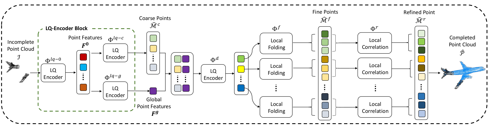

# GlanceNet

<p align = 'center'>

</p>

This repository serves as an **archival (unofficial) version** of the PyTorch implementation for the following paper:
**GlanceNet: Ultra Fast Point Cloud Shape Completion Network**<br>
[Kevin Tirta Wijaya](https://www.ktirta.xyz), [Dong-Hee Paek](http://ave.kaist.ac.kr/bbs/board.php?bo_table=sub1_2&wr_id=5&sca=Ph.+D.+Candidate), and [Seung-Hyun Kong](http://ave.kaist.ac.kr/)<br>
[\[**preprint**\]](https://drive.google.com/file/d/1zHIulBKP52kRTSHQpNSl_XUkWD06uIgF/view?usp=sharing)
> **Abstract:** *Recent point cloud shape completion networks have achieved remarkable completion accuracy. Unfortunately, most of the networks have shown either slow processing speed but high accuracy due to the complexity of the architectures or fast processing but low accuracy. Therefore, those networks are unsuitable for real-time applications. In this work,
we propose a novel point cloud shape completion network, GlanceNet, that can estimate the missing points of an incomplete object-level point cloud with both high completion accuracy and fast inference speed. To achieve these two goals, GlanceNet utilizes two-step process, where in the first step, an LQ-Encoder Block is proposed to quickly model the correlations between input points, extract geometrically-aware point features, and predict the missing points in a coarse-to-fine approach. In the second step, GlanceNet employs a granular level refinement process that can estimate the details of a local neighborhood of missing points. Because of the proposed LQ-Encoder Block and the locality of the refinement process, GlanceNet can efficiently learn both global and local geometric structures of the point cloud and accurately estimate the missing points within by far the shortest inference time. Specifically, on the ShapeNet55 benchmark, GlanceNet runs 6.2 times faster than the previous state-of-the-art, reduces the number of parameters by 20 times, and improves the completion performance in terms of CDl2 metric.*


**Installation**

1. Install PyTorch (tested on 1.11.0, cuda 11.3)
```
conda install pytorch==1.11.0 torchvision==0.12.0 torchaudio==0.11.0 cudatoolkit=11.3 -c pytorch
```
2. Install other dependencies
```
pip install -r requirements.txt
```
3. Install chamfer distance and pointnet utils
```
bash install.sh
```
If you got errors with install.sh, you can try to go to each directory (utils/chamfer and utils/pointnet2), and run:
```
python setup.py install --user
```
**Dataset Preparation**

The datasets are based on PoinTr (Xumin Yu, https://github.com/yuxumin/PoinTr/blob/master/DATASET.md)
1. Download ShapeNet55/34 dataset at https://drive.google.com/file/d/1jUB5yD7DP97-EqqU2A9mmr61JpNwZBVK/view?usp=sharing
2. Download PCN dataset at https://gateway.infinitescript.com/?fileName=ShapeNetCompletion
3. Download KITTI dataset at https://drive.google.com/drive/folders/1fSu0_huWhticAlzLh3Ejpg8zxzqO1z-F

4. Please organize the directory as follows:
```
GlanceNet/
|
├──cfgs/
├──core/
├──data/
    ├──KITTI/
        ├──bboxes/
        ├──cars/
        ├──tracklets/
        └──KITTI.json
    ├──pcn/
        ├──test/
        ├──train/
        ├──val/
        ├──category.txt
        └──PCN.json
    └──shapenet55-34/
        ├──shapenet_pc/
            ├──02691156-1a04e3eab45ca15dd86060f189eb133.npy
            └── ...
        ├──shapenet21/
            └──test.txt
        ├──shapenet34/
            ├──test.txt
            └──train.txt
        ├──shapenet55/
            ├──test.txt
            └──train.txt
```


**Evaluation**

1. Evaluate on ShapeNet55
```
python test.py --cfg_file cfgs/shapenet55/GlanceNet.yaml --ckpt experiments/shapenet55.pth
```
2. Evaluate on ShapeNet34

For ShapeNet34-seen:
```
python test.py --cfg_file cfgs/shapenet34/GlanceNet.yaml --ckpt experiments/shapenet34.pth
```
For ShapeNet34-unseen:
```
python test.py --cfg_file cfgs/shapenet21/GlanceNet.yaml --ckpt experiments/shapenet21.pth
```

3. Evaluate on KITTI

First, save the predictions to a directory:
```
python save_KITTI_preds.py --cfg_file cfgs/kitti/GlanceNet.yaml --ckpt experiments/kitti.pth --save_dir experiments/KITTI/
```

Second, evaluate for fidelity and MMD:
```
python KITTI_metric_fastMMD.py --exp_dir experiments/KITTI/
```

**Training**

To train from scratch:
```
python train.py --cfg_file [path to cfg] --exp_name [dir name for the experiment] --val_steps [n (int), where evaluation on the test set is performed every n epoch]
```
